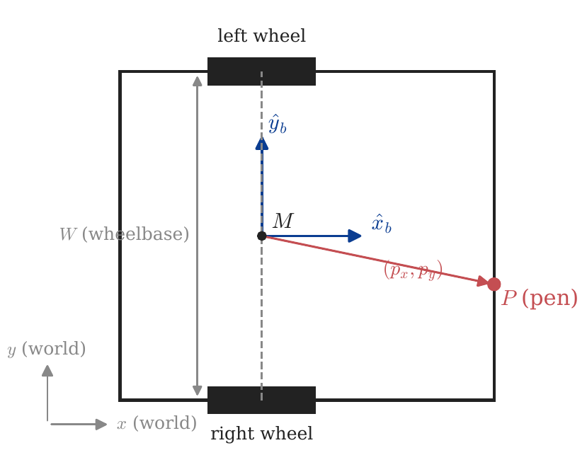
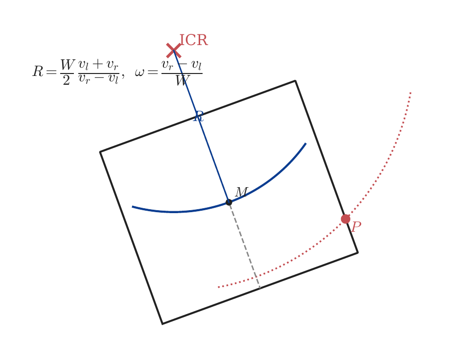
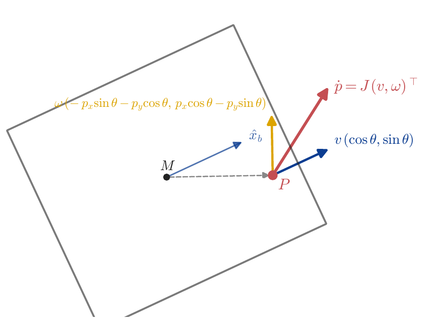
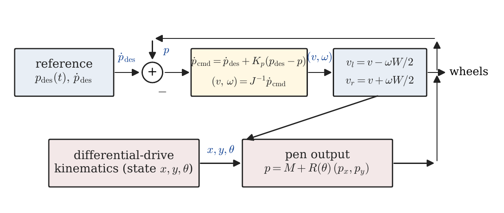

\newpage

# Introduction

The DrawingRobot is a differential-drive chassis with a pen rigidly attached on the chassis outline. The robot draws by moving across a surface; the curve we see on paper is the **pen's trajectory**, not the body's. Because the pen is bolted to the chassis, the pen-tip cannot be moved independently — it is dragged around by whatever the wheels do.

This creates a tension. Differential drive has only two control inputs $(v_l, v_r)$ but three pose variables $(x, y, \theta)$, and it is **non-holonomic**: the body cannot translate sideways. So if the pen is *also* on the wheel-axis line, the pen inherits exactly the same constraint and cannot draw a sharp corner — every direction change forces a circular arc of radius at least $|p_\text{body}|$ on the page.

The good news, and the central result of this note: as soon as the pen sits **off** the wheel-axis line ($p_x \neq 0$ in the body frame), the pen is no longer constrained the way the body is. We can command any 2-D pen velocity we like, in real time, by inverting a $2 \times 2$ Jacobian whose determinant is exactly $p_x$. The pen tracks a polyline — corners and all — within timestep discretisation, while the body weaves underneath to make this happen.

This document covers:

1. The kinematics of the chassis (Tema 1).
2. The pen as an output point and its Jacobian (Tema 2).
3. The fundamental constraint on single-arc pen radius (Tema 3).
4. The feedback-linearisation control law that produces the `trace` primitive (Tema 4).
5. Practical comparison of the three drawing strategies the codebase implements: `goto`, `line_to`, `trace` (Tema 5).

The reader is expected to have first-year linear algebra (matrix inversion, $2 \times 2$ rotations) and a working idea of differential equations and feedback control. No prior robotics background is assumed.

\newpage

# Tema 1 — Differential-drive kinematics

The chassis is a rigid rectangle of width $W$ (between the wheels) and length $L$ (along the heading axis). Two independently driven wheels are mounted directly opposite each other on the two long sides, on a shared **wheel axis**. The midpoint of that axis, $M$, is the natural reference frame origin: the entire body's pose is determined by $M$'s world coordinates $(x, y)$ and the body's heading $\theta$ (measured CCW from world $+x$).

{width=85%}

## 1.1 Wheel commands and body velocities

Let $v_l$ and $v_r$ be the linear speeds of the left and right wheel contact points. The body's linear speed (along its heading) and angular speed are

$$\boxed{\;v = \tfrac{1}{2}(v_l + v_r), \quad \omega = \dfrac{v_r - v_l}{W}\;}$$

These are the standard differential-drive equations. Set $v_l = v_r$ and the body translates straight; set $v_l = -v_r$ and it spins in place about $M$; otherwise it follows a circular arc.

Units: all quantities are in SI (cm and seconds in the simulator, but the physics is unit-agnostic). Typical numbers for the robot:

| Quantity | Symbol | Typical value |
|----------|--------|---------------|
| Wheelbase | $W$ | $20.4$ cm |
| Chassis length | $L$ | $23.2$ cm |
| Linear speed | $v$ | $\le 12$ cm/s |
| Angular speed | $\omega$ | $\le \pi$ rad/s ($180^\circ$/s) |

## 1.2 Pose evolution

In the world frame, the wheel-midpoint moves along its current heading and rotates about its instantaneous centre of rotation (ICR):

$$\boxed{\;\dot{x} = v\cos\theta, \quad \dot{y} = v\sin\theta, \quad \dot{\theta} = \omega\;}$$

Notice that $\dot{x}$ and $\dot{y}$ are coupled by $\theta$ — the body cannot have $\dot{x} \neq 0$ in a direction other than $\theta$. That is the **non-holonomic constraint**:

$$\boxed{\;\dot{x}\,\sin\theta - \dot{y}\,\cos\theta = 0\;}$$

In words: $M$ moves only along the heading direction, never perpendicular to it. A car cannot slide sideways. Neither can $M$.

## 1.3 The instantaneous centre of rotation (ICR)

For any pair $(v_l, v_r)$ with $v_l \neq v_r$, the body traces a circle. The centre of that circle, the ICR, lies on the wheel-axis line, at distance $R$ from $M$ given by

$$\boxed{\;R = \dfrac{v}{\omega} = \dfrac{W}{2}\,\dfrac{v_l + v_r}{v_r - v_l}\;}$$

The pen, mounted somewhere on the body, traces a concentric circle of radius $|R - p_x|$ when measured along the body $x$-axis at the level of the pen — but more usefully, of radius $|\text{ICR} - P|$ where $P$ is the pen's world position. This is the picture in Figure 2.

{width=85%}

## Lo esencial de Tema 1

| Concept | Formula |
|---------|---------|
| Body linear / angular speed | $v=\tfrac{1}{2}(v_l+v_r),\;\omega=(v_r-v_l)/W$ |
| Pose ODE | $\dot{x}=v\cos\theta,\;\dot{y}=v\sin\theta,\;\dot{\theta}=\omega$ |
| Non-holonomic constraint | $\dot{x}\sin\theta-\dot{y}\cos\theta=0$ |
| ICR / arc radius | $R=v/\omega=(W/2)(v_l+v_r)/(v_r-v_l)$ |

**Things you cannot forget:**

1. The pose tracked is the **wheel-midpoint** $M$, *not* the chassis centre. They only coincide when the wheels are at the chassis midline.
2. Two inputs $(v_l, v_r)$, three states $(x, y, \theta)$ — under-actuated. The body cannot slide sideways.
3. Any constant-input command paints a circle (or, in the limits $\omega = 0$ or $v = 0$, a line or a point).

\newpage

# Tema 2 — The pen as an output point

The body is what we control; the pen is what we care about. They are related by a fixed offset in the body frame:

$$\boxed{\;P = M + R(\theta)\,\begin{pmatrix}p_x\\p_y\end{pmatrix},\quad R(\theta)=\begin{pmatrix}\cos\theta & -\sin\theta\\ \sin\theta & \cos\theta\end{pmatrix}\;}$$

So the pen's world coordinates are

$$P_x = x + p_x \cos\theta - p_y \sin\theta, \qquad P_y = y + p_x \sin\theta + p_y \cos\theta.$$

The pen's *velocity* — the quantity we will want to command — is the time derivative of $P$:

$$\dot P_x = \dot x - (p_x\sin\theta + p_y\cos\theta)\,\dot\theta, \qquad \dot P_y = \dot y + (p_x\cos\theta - p_y\sin\theta)\,\dot\theta.$$

Substituting the body kinematics ($\dot x = v\cos\theta$, $\dot y = v\sin\theta$, $\dot\theta = \omega$) gives a clean linear map from body inputs to pen velocity:

$$\boxed{\;\begin{pmatrix}\dot P_x\\ \dot P_y\end{pmatrix}
= \underbrace{\begin{pmatrix}\cos\theta & -(p_x\sin\theta+p_y\cos\theta)\\ \sin\theta & \;\;p_x\cos\theta-p_y\sin\theta\end{pmatrix}}_{J(\theta)}\,
\begin{pmatrix}v\\ \omega\end{pmatrix}\;}$$

$J(\theta)$ is the **pen Jacobian**. It is a $2\times 2$ matrix that depends on heading but not on position. Each column has a clear meaning:

- **Column 1** ($v$ contribution): $(\cos\theta,\sin\theta)$ — the body's heading direction. Pure forward translation moves the pen along the heading.
- **Column 2** ($\omega$ contribution): rotation by $\omega$ about $M$ moves the pen perpendicular to the line from $M$ to $P$, with magnitude proportional to $\|MP\|$.

Figure 3 shows this decomposition geometrically.

{width=85%}

## 2.1 The determinant of $J$

Computing the determinant:

$$\det J(\theta) = \cos\theta\,(p_x\cos\theta - p_y\sin\theta) - \sin\theta\,\bigl(-(p_x\sin\theta + p_y\cos\theta)\bigr)$$

Expanding,

$$= p_x\cos^2\theta - p_y\sin\theta\cos\theta + p_x\sin^2\theta + p_y\sin\theta\cos\theta = p_x(\cos^2\theta + \sin^2\theta) = p_x.$$

That is the central identity:

$$\boxed{\;\det J(\theta) = p_x\;}$$

It is independent of $\theta$ and of $p_y$. The determinant equals the *body x-coordinate of the pen* — the offset along the heading axis.

## 2.2 What the determinant tells us

A $2\times 2$ matrix is invertible iff its determinant is nonzero. So $J(\theta)$ is invertible **for every $\theta$** if and only if $p_x \neq 0$, i.e. the pen sits off the wheel-axis line. When $J$ is invertible, *any* commanded pen velocity $\dot P_\text{cmd}$ can be realised by setting

$$\begin{pmatrix}v\\ \omega\end{pmatrix} = J(\theta)^{-1}\,\dot P_\text{cmd}.$$

This is **feedback linearisation at the offset point**: the input–output map $(v,\omega)\to \dot P$ is invertible, so the pen behaves like a fully actuated 2-D point mass even though the body underneath is non-holonomic.

When $p_x = 0$, the pen is on the wheel-axis line. $J$ is singular for every $\theta$. The pen inherits the body's non-holonomy: its instantaneous velocity is constrained to the body $\hat y_b$-direction (sideways from the body's heading) and cannot be commanded freely.

## 2.3 The inverse Jacobian

For $p_x \neq 0$, the closed form of $J^{-1}$ is convenient to have on hand. Let

$$a = p_x\sin\theta + p_y\cos\theta, \qquad b = p_x\cos\theta - p_y\sin\theta.$$

Then

$$\boxed{\;J^{-1}(\theta) = \dfrac{1}{p_x}\begin{pmatrix} b & a \\ -\sin\theta & \cos\theta \end{pmatrix}\;}$$

so that, given a commanded pen velocity $(\dot P_x, \dot P_y)$,

$$\boxed{\;v = \dfrac{b\,\dot P_x + a\,\dot P_y}{p_x},\qquad \omega = \dfrac{-\sin\theta\,\dot P_x + \cos\theta\,\dot P_y}{p_x}\;}$$

These are the formulas the code uses every timestep inside `_plan_trace`.

## Lo esencial de Tema 2

| Concept | Formula |
|---------|---------|
| Pen world position | $P = M + R(\theta)(p_x,p_y)^\top$ |
| Pen Jacobian | $\dot P = J(\theta)(v,\omega)^\top$ |
| Determinant | $\det J = p_x$ |
| Inverse | $\omega=(-\sin\theta\,\dot P_x+\cos\theta\,\dot P_y)/p_x$ |

**Things you cannot forget:**

1. $\det J = p_x$ — the pen's body-frame $x$-coordinate, independent of $\theta$ and of $p_y$.
2. The pen is freely controllable in 2-D iff $p_x \neq 0$. The wheel-axis line is the singular set.
3. Singularity-aware: even at $p_x \neq 0$, $\omega$ scales like $1/p_x$. A pen *near* the axis ($|p_x|$ small) demands very large $\omega$ for moderate $\dot P$.

\newpage

# Tema 3 — The single-arc lower bound

Before introducing the feedback-linearised tracker (Tema 4), it is worth understanding what a **single, constant** $(v_l, v_r)$ command can and cannot do for the pen. Many simple drawing primitives — `arc`, `circle`, the in-place rotation that precedes `forward` — are exactly that: one constant command for some duration.

## 3.1 In-place rotation

Set $v_l = -v_r$. Then $v = 0$, and the body rotates about $M$ at angular speed $\omega = 2v_r/W$. The pen, rigidly mounted at body offset $(p_x, p_y)$, traces a circle about $M$ of radius

$$\boxed{\;r_\text{spin} = \sqrt{p_x^2 + p_y^2} = |p_\text{body}|\;}$$

For the simulator's default front-mid pen $(p_x, p_y) = (14.4, 0)$, the in-place spin paints a circle of radius $14.4$ cm centred on $M$. This is the **most "concentrated" corner** the robot can paint with one command.

## 3.2 General constant-velocity command

For any $(v, \omega)$ with $\omega \neq 0$, the body's ICR is at distance $R = v/\omega$ from $M$ along the wheel-axis, and the pen circles the ICR at radius

$$r_\text{pen} = \|\text{ICR} - P\|.$$

Minimising over choice of $R$ (the only free parameter once the pen offset is fixed): the closest the ICR can ever come to $P$ is by choosing $R = p_y$ (placing the ICR exactly under $P$ on the wheel-axis), giving $r_\text{pen} = |p_x|$. Any other choice gives $r_\text{pen} \geq |p_x|$. So:

$$\boxed{\;r_\text{pen}\;\ge\;|p_x|\quad\text{for any single constant-input command}\;}$$

This is a hard kinematic floor. **No single arc command — including in-place rotation, which is just the limit $R = 0$ — can paint a corner of radius smaller than $|p_x|$.**

## 3.3 What this means in practice

The figure below illustrates: each point on the chassis outline gives a different swept-circle radius when we command in-place rotation. Only the two wheel positions (where $p_x = 0$) produce a zero-radius circle — i.e., a sharp corner.

{width=80%}

So if you bolt the pen anywhere on the chassis outline *except* exactly at one of the two wheels, no constant-input command can give you a sharp corner. If you want sharp corners — the `square_pen.script` and `square_lines.script` results bear this out — you cannot get them with primitives that emit one wheel command per move.

The way out is to emit *many* wheel commands per move and let the inputs vary in time. That is Tema 4.

## Lo esencial de Tema 3

| Concept | Formula |
|---------|---------|
| In-place spin radius | $r_\text{spin}=\sqrt{p_x^2+p_y^2}$ |
| General arc radius | $r_\text{pen}=\|\text{ICR}-P\|\ge\|p_x\|$ |
| Sharp-corner locus | $p_x=0$ (wheel-axis line) |

**Things you cannot forget:**

1. Single-arc primitives have a hard lower bound on corner radius equal to $|p_x|$.
2. The bound is saturated when the ICR is placed directly under the pen. That is the best a constant command can do.
3. To beat the bound, the inputs must vary inside the "corner" — i.e., feedback control.

\newpage

# Tema 4 — Feedback-linearised tracking

We now have all the pieces. Pen velocity is a linear function of body inputs through $J(\theta)$ (Tema 2), and $J$ is invertible whenever $p_x \neq 0$. So we can pick *any* desired pen velocity, every timestep, and find body inputs that realise it. That is the entire idea of the `trace` primitive.

## 4.1 Reference path

The user's input is a polyline $V_0 \to V_1 \to V_2 \to \cdots \to V_n$ in pen coordinates. The first vertex $V_0$ is the pen's *current* world position; subsequent vertices are the user-specified targets.

Each edge $i$ is parameterised by arc length $s \in [0, \ell_i]$, where $\ell_i = \|V_{i+1} - V_i\|$ and the unit tangent is $\hat t_i = (V_{i+1} - V_i)/\ell_i$. We choose a constant pen speed $v_\text{pen}$ (the script's `speed` setting) and discretise time at $\Delta t = 1/120\,\text{s}$, giving $\lceil \ell_i / (v_\text{pen}\,\Delta t)\rceil$ steps per edge. At step $k$ along edge $i$:

$$P_\text{des}(k) = V_i + \min(k\,v_\text{pen}\,\Delta t,\;\ell_i)\,\hat t_i, \qquad \dot P_\text{des} = v_\text{pen}\,\hat t_i.$$

## 4.2 Control law

A pure feedforward law — set $\dot P_\text{cmd} = \dot P_\text{des}$ each step — would track perfectly only if the pose evolved exactly according to the integrated kinematics. In practice, integration error drifts the pen off the desired path. We add a proportional correction:

$$\boxed{\;\dot P_\text{cmd} = \dot P_\text{des} + K_p\,(P_\text{des} - P_\text{cur})\;}$$

with $K_p = 8\,\text{s}^{-1}$ in the codebase. The structure is **feedforward + P-feedback at the output**: the feedforward keeps the pen moving along the edge, the feedback pulls it back if it drifts. Then we invert the Jacobian to get body inputs:

$$\begin{pmatrix}v\\ \omega\end{pmatrix} = J(\theta)^{-1}\,\dot P_\text{cmd},$$

and finally convert to wheel speeds by the standard differential-drive map:

$$v_l = v - \omega W/2, \qquad v_r = v + \omega W/2.$$

That is the loop. Block-diagram form:

{width=92%}

## 4.3 What sharp corners look like inside this loop

At a vertex of the polyline, $\dot P_\text{des}$ flips direction in one timestep — going from $v_\text{pen}\,\hat t_i$ to $v_\text{pen}\,\hat t_{i+1}$. The inverse-Jacobian solve still gives a finite $(v, \omega)$, just briefly with very large $|\omega|$: the body has to spin fast for one or two ticks to swing the pen-tip around. The pen tracks the corner exactly within $O(v_\text{pen}\,\Delta t)$ rounding; the body trajectory underneath is generally not a polyline — it weaves and loops to make the pen-tip do what is asked of it.

{width=90%}

## 4.4 Failure modes and limits

There are three things to be careful about:

1. **Singularity at $p_x = 0$.** $J^{-1}$ blows up. The codebase rejects `trace` for pens on the wheel-axis line; use `line_to` or `goto` there. (For pens *near* the axis, $\omega$ stays finite but is large.)
2. **Actuator saturation.** Sharp corners demand peak $|\omega|$ proportional to $1/p_x$ and to how sharp the angle is. If the wheels saturate, the pen cuts the corner.
3. **Discretisation ringing.** $K_p\,\Delta t$ acts as a discrete-time feedback gain. If $K_p$ is much larger than $1/\Delta t$ the inner loop oscillates. The default $K_p\,\Delta t = 8/120 \approx 0.067$ is comfortably stable.

A more robust planner would (a) approach the first vertex with a setup move so the body starts on a feasible trajectory, (b) bound $|\omega|$ to a maximum and round corners only when it would otherwise saturate, and (c) damp the corner sharpness when $|p_x|$ is small. The current implementation does none of these — the corner lemma is purely kinematic, not an optimal-control statement.

## Lo esencial de Tema 4

| Concept | Formula |
|---------|---------|
| Reference along edge $i$ | $P_\text{des} = V_i + s\,\hat t_i$, $\dot P_\text{des} = v_\text{pen}\hat t_i$ |
| Control law | $\dot P_\text{cmd} = \dot P_\text{des} + K_p(P_\text{des}-P_\text{cur})$ |
| Body inputs | $(v,\omega) = J(\theta)^{-1}\,\dot P_\text{cmd}$ |
| Wheel speeds | $v_l = v - \omega W/2,\;v_r = v + \omega W/2$ |

**Things you cannot forget:**

1. The trick is having an output point with $p_x \neq 0$. With that, the non-holonomic robot becomes a holonomic 2-D point in pen coordinates.
2. The feedforward keeps the pen on track; the P-feedback corrects for integration drift.
3. The body trajectory is "free" — whatever the wheels need to be doing to make the pen-tip behave is what they will do.

\newpage

# Tema 5 — Three drawing strategies, side by side

The codebase implements three pen-aware path commands, each with a different idea about where to put the corner curvature:

- **`goto X Y`** — pen *lands* on $(X, Y)$. Plans `rotate-then-forward`. Each leg is two wheel commands. The rotation sweeps a pen circle of radius $|p_\text{body}|$ centred on $M$ — the corner curve is large and centred *between* polyline vertices.
- **`line_to X Y`** — pen *draws* a straight line from its current world position to $(X, Y)$. Plans `rotate-translate-rotate setup` + `forward`. The setup repositions $M$ so the pen sits at the same world point but with the body aligned to the new edge direction. Each polyline edge is then exactly straight on the page; the corner curvature is concentrated at the vertex (the setup translation $|\Delta| = \sqrt{2}\,|p_\text{body}|$ for a $90^\circ$ turn).
- **`trace V_1 V_2 ... V_n`** — pen tracks the polyline via the feedback linearisation of Tema 4. Each edge is straight; the corners are sharp within timestep discretisation.

Figure 7 runs the three plans against a $30\,\text{cm}$ square with the same off-axis pen $p_x = 14.4\,\text{cm}$, $p_y = 0$. Body trajectory in blue, pen in red.

{width=100%}

A few observations:

- **`goto` produces a chaotic shape.** The intended polyline is the dashed grey diamond; the actual pen trace cuts across because each leg's setup rotation paints an arc whose curvature is centred *between* the corners. With $|p_\text{body}| = 14.4$ cm and $30$ cm legs, the arcs dominate the legs.
- **`line_to` paints the four edges correctly** (straight line on the page) but the corner setup translates $M$ by $|\Delta| = \sqrt 2 \times 14.4 \approx 20$ cm, and that pen-loop projects outward from each vertex.
- **`trace` paints a square.** The pen lands on each vertex (within $\sim 0.2$ cm at the final vertex, dominated by integration drift over the full path); the body $M$ traces a curve inside the square — small circles at each corner where the body has to swing fast for the pen to turn.

## 5.1 When to pick which

| Strategy | Pen tracks polyline? | Corner radius | Cost |
|----------|----------------------|---------------|------|
| `goto`   | only at vertices     | bulges *between* legs, radius $\sim |p_\text{body}|$ | 2 wheel cmds / leg |
| `line_to`| edges yes, corners no | localized at vertex, $|\Delta|=\sqrt 2 |p_\text{body}|$ for $90^\circ$ | 4 wheel cmds / leg |
| `trace`  | yes, including corners | $\sim v_\text{pen}\Delta t$ | $\sim \ell_i / (v_\text{pen}\Delta t)$ wheel cmds / edge |

For a pen close to the wheel-axis line ($|p_x|$ small), `trace` will demand large $\omega$ at corners and may saturate. In that regime `line_to` is more robust at the cost of visible corner arcs. For a pen far from the axis (front-mid mounting in particular, $|p_x|$ comparable to the chassis half-length), `trace` wins on every metric.

For a pen *exactly* on the wheel-axis line ($p_x = 0$), `trace` is undefined and must not be used. `line_to` and `goto` reduce to pure rotate-then-translate plans (no setup translation, since the pen is on the axis), and the body is just driven directly. In that special case the body and pen trace coincide and sharp corners come for free — but everything else suffers, e.g. the pen cannot move sideways at all within an edge, only along the heading.

## Lo esencial de Tema 5

| Strategy | Where the corner curvature goes |
|----------|---------------------------------|
| `goto` | between polyline vertices (large arcs span the leg) |
| `line_to` | localised at each vertex (chunky corner, but edges are exact) |
| `trace` | nowhere — corner is sharp, body absorbs the curvature |

**Things you cannot forget:**

1. With an off-axis pen, **edges and corners are independent design choices**. `line_to` makes edges exact but corners chunky; `trace` makes both edges and corners exact at the cost of more wheel commands per second.
2. The corner-radius bound $|p_x|$ is a property of *single-arc* primitives. `trace` sidesteps it with per-timestep control.
3. The body's path is not the pen's path. Watch the body-trajectory overlay if the pen looks weird — it is often the body (not the pen) running into geometric absurdity.

\newpage

# Apéndice — Final formulary

A consolidated reference. Symbols are defined where introduced; this is for quick review.

## Body kinematics

$$v = \tfrac{1}{2}(v_l + v_r),\qquad \omega = \dfrac{v_r - v_l}{W}$$
$$\dot x = v\cos\theta,\quad \dot y = v\sin\theta,\quad \dot\theta = \omega$$
$$R = v/\omega = \dfrac{W}{2}\,\dfrac{v_l + v_r}{v_r - v_l}$$
$$\dot x\sin\theta - \dot y\cos\theta = 0 \quad\text{(non-holonomic constraint)}$$

## Pen as an output point

$$P = M + R(\theta)\,(p_x, p_y)^\top$$
$$P_x = x + p_x\cos\theta - p_y\sin\theta,\qquad P_y = y + p_x\sin\theta + p_y\cos\theta$$

## Pen Jacobian

$$J(\theta) = \begin{pmatrix}\cos\theta & -(p_x\sin\theta+p_y\cos\theta)\\ \sin\theta & p_x\cos\theta-p_y\sin\theta\end{pmatrix},\qquad \det J = p_x$$

$$J^{-1}(\theta) = \dfrac{1}{p_x}\begin{pmatrix}b & a\\ -\sin\theta & \cos\theta\end{pmatrix}$$

with $a = p_x\sin\theta+p_y\cos\theta,\;b = p_x\cos\theta-p_y\sin\theta$.

## Tracking control law

$$\dot P_\text{cmd} = \dot P_\text{des} + K_p\,(P_\text{des} - P_\text{cur})$$
$$(v, \omega)^\top = J(\theta)^{-1}\,\dot P_\text{cmd}$$
$$v_l = v - \omega W/2,\qquad v_r = v + \omega W/2$$

## Single-arc lower bound

$$r_\text{pen} \ge |p_x| \quad\text{for any single-input command}$$
$$r_\text{spin} = \sqrt{p_x^2 + p_y^2}\quad\text{(in-place rotation, $v=0$)}$$

## Default constants in the codebase

| Constant | Symbol | Value |
|----------|--------|-------|
| Chassis length | $L$ | $23.2$ cm |
| Chassis width / wheelbase | $W$ | $20.4$ cm |
| Wheel offset from back | $\ell_\text{wo}$ | $8.8$ cm |
| Wheel diameter | $d_w$ | $6.6$ cm |
| Linear pen speed | $v_\text{pen}$ | $12$ cm/s |
| Angular speed (rotation primitive) | $\omega_\text{rot}$ | $\pi$ rad/s |
| Tracking timestep | $\Delta t$ | $1/120$ s |
| Tracking P-gain | $K_p$ | $8$ s$^{-1}$ |

## SI units used

| Quantity | Symbol | Unit |
|----------|--------|------|
| Length | $x, y, p_x, p_y$ | m (the simulator uses cm; physics is unit-agnostic) |
| Angle | $\theta$ | rad |
| Linear speed | $v, v_l, v_r$ | m/s |
| Angular speed | $\omega$ | rad/s |
| Time | $t, \Delta t$ | s |
| Wheelbase | $W$ | m |
